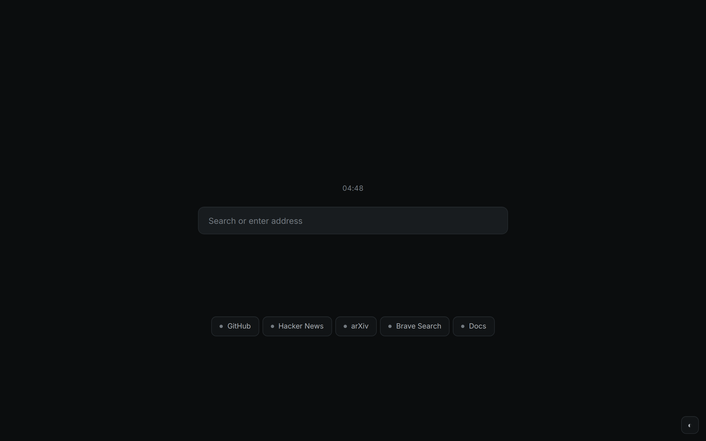
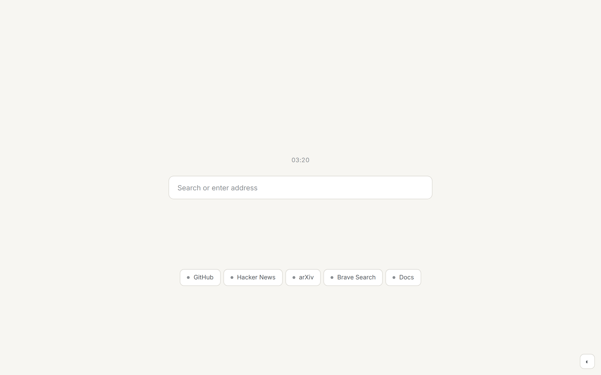
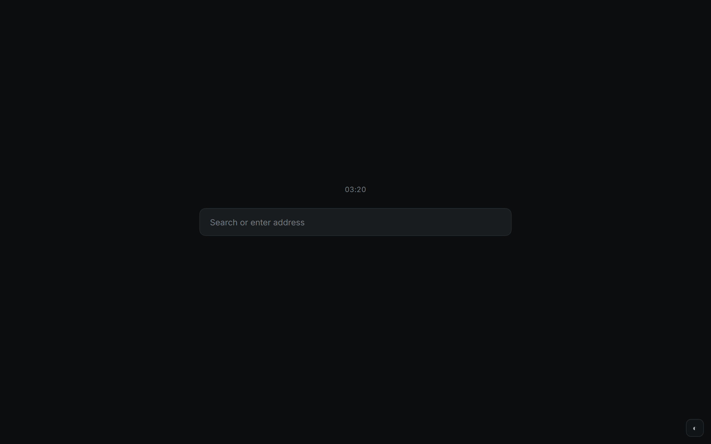
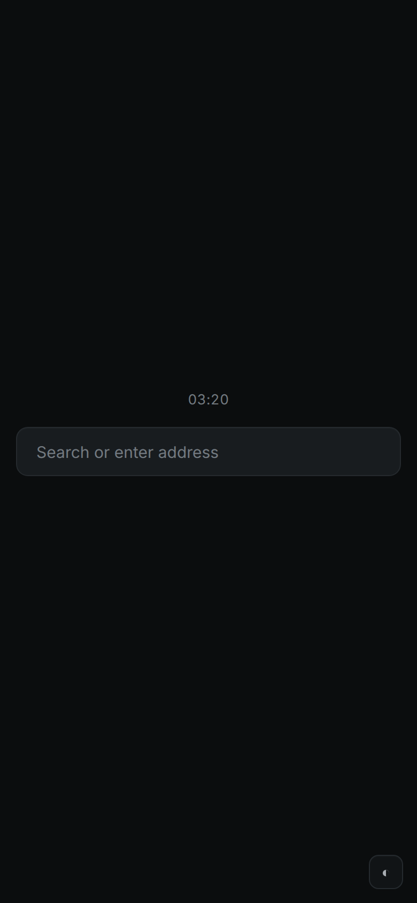

# Keel Browser

A calm, security-oriented browser. Brave under the hood, Keel on top.

Keel is a thin distribution layer over upstream **Brave Stable**. We do not fork Chromium. We do not touch security-sensitive internals. We disable Brave's product clutter via policies, ship a minimal Safari-inspired new tab, and pass everything else through.

| | |
|---|---|
| Upstream | [Brave Stable](https://github.com/brave/brave-browser) |
| Current Brave | see `build/keel.json` |
| Spec | [`KEEL_BROWSER_SPEC.md`](KEEL_BROWSER_SPEC.md) |
| License | MIT (Keel layer); Brave/Chromium retain their own licenses |

## What Keel changes

**Disabled or hidden via policy** (`policies/`):

- Brave Rewards
- Brave Wallet
- Brave VPN
- Brave Leo AI
- Brave Talk
- WebTorrent
- Speedreader
- Search suggestions, predictions, translate, metrics, alternate-error pages
- All autofill (address + credit card)

**Enforced via policy:**

- HTTPS-only mode
- Block third-party cookies
- Safe Browsing on (Standard protection, level 1; no extended reporting)
- Component updates on (these carry security fixes)
- Password manager + leak detection on

**Replaced via patches** (`patches/`):

- Product strings: `Brave` → `Keel`
- Toolbar buttons for Rewards / Wallet / Leo: hidden in `BraveToolbarView`
- **Top bar:** 28-px peek strip in steady state; full single-row toolbar slides down on cursor proximity / `F6` / `Ctrl+L`. Native title bar replaced on every platform. (`patches/0004-keel-topbar-autohide.patch`)
- **Per-tab tinting:** each tab's accent color is extracted from the page's `<meta theme-color>` or favicon, calmed through HSL clamping, then applied to the URL underline, tab marker, and strip glow. (`patches/0005-keel-per-tab-accent-tint.patch`)
- Default new tab page: Keel's static bundle (`newtab/`)

Design: [`docs/design/navbar-ideas.md`](docs/design/navbar-ideas.md) walks the 14 candidates we considered and the three accepted decisions.
Implementation: [`docs/design/implementation.md`](docs/design/implementation.md) maps every paint and state-machine transition to a concrete file.

**Not changed:**

V8, Blink, the network service, certificate verification, sandboxing, site isolation, WebRTC, WebGPU, PDFium, media parsers, image parsers, font parsers, extension permission model, password manager crypto, Safe Browsing, component updates. Profile dir, binary name, bundle ID, channel names, and the User-Agent brand token are kept verbatim so Brave's updater and component-update channel keep working.

## Two install paths

### 1. Policy-only (no recompile)

This is what most users want. Install upstream Brave Stable, then run:

```sh
# Linux
sudo bash scripts/install-policy.sh

# macOS
sudo bash scripts/install-policy.sh

# Windows  (elevated PowerShell)
reg import policies\windows\keel.reg
```

You get ~80% of the spec (everything except branding rename, the Safari top bar, and the WebUI new-tab swap). Survives every Brave Stable update without intervention.

### 2. Source build (full Keel)

For the full "Keel.app" experience with custom branding and the patched UI:

```sh
scripts/sync-upstream.sh                  # fetch latest Brave tag → build/upstream.json
scripts/clone-upstream.sh                 # shallow clone upstream/brave-browser
scripts/apply-patches.sh --check          # dry-run apply
scripts/apply-patches.sh                  # apply for real
scripts/build-linux.sh                    # (or build-macos.sh / build-windows.sh)
scripts/smoke-test.sh                     # runs tests/smoke/run.js
```

A full Brave source build pulls Chromium + chromium-src and takes hours on first build. See [Brave's docs](https://github.com/brave/brave-browser/wiki/Linux-Development-Environment) for host-prep requirements.

## Update workflow

Keel's value depends on staying close to upstream. Rebases are designed to be small.

```sh
# nightly cadence (also driven by ci/workflows/upstream-watch.yml)
scripts/sync-upstream.sh
scripts/security-lag.sh
```

If `security-lag.sh` reports lag above the spec's SLA, the workflow is:

1. Re-run `clone-upstream.sh` to pull the new tag
2. `apply-patches.sh --check` — if all patches apply, run `apply-patches.sh`
3. If a patch fails, fix the patch (not the tree) and re-run
4. Rebuild, smoke-test
5. Update `build/keel.json` with the new versions
6. Tag a release

The `security-lag.sh` output is the exact shape the spec mandates:

```text
Upstream Brave:    1.90.124
Upstream Chromium: 148.0.7778.179
Keel:              1.90.124-keel.1
Security lag:      0h
Patch status:      clean
Build status:      passing
```

## Security SLA

The spec sets these targets. Keel CI watches upstream and files an issue when the SLA is at risk.

| Severity | SLA | Action |
|---|---|---|
| Critical / actively exploited | ≤ 24h | Out-of-cycle rebase + release |
| High | ≤ 48h | Same-week rebase |
| Normal | 3–5 days | Next planned rebase |
| > 72h | — | README banner advises using official Brave until catch-up |

## Layout

```
keel-browser/
├── KEEL_BROWSER_SPEC.md     ← the source of truth
├── README.md                ← you are here
├── policies/                ← managed policies + master_preferences (~80% of debloat)
│   ├── linux/
│   ├── macos/
│   ├── windows/
│   └── master_preferences.json
├── patches/                 ← six small UI/branding patches against Brave
├── newtab/                  ← Keel's static new tab bundle (html/css/js)
├── theme/                   ← color + topbar tokens
├── branding/                ← icon, strings, what-we-rename
├── scripts/                 ← sync-upstream, apply-patches, smoke-test, security-lag, install-policy
├── tests/smoke/             ← puppeteer-driven smoke runner
├── ci/workflows/            ← upstream-watch / build / security-lag
└── build/                   ← generated: upstream.json, keel.json, smoke/, preview/
```

## Previews

The new tab bundle in `newtab/` rendered in Brave at 1280×800:

| Dark (with pinned sites) | Light | Empty (dark) | Mobile |
|---|---|---|---|
|  |  |  |  |

These are checked in at `build/preview/` for the README to render on GitHub.

## Verifying a Keel install

```sh
brave-browser --no-sandbox &     # or just open Brave normally
```

Then in the browser:

- `brave://policy` — every policy in `policies/linux/keel-managed-policy.json` should appear with **Source: Platform**, **Level: Mandatory**, **Status: OK**
- `brave://settings` — search "Rewards" / "Wallet" / "VPN" / "Leo"; they should be greyed out or missing
- `brave://newtab` — Keel's bundle (after `apply-patches.sh`) or a quiet Brave NTP (policy-only path)

## License & credit

Keel is a thin layer. The hard work — sandboxing, V8, networking, Safe Browsing, the Chromium release cadence — is done by the Brave and Chromium projects. Keel's contribution is product-layer restraint, not browser engineering.
